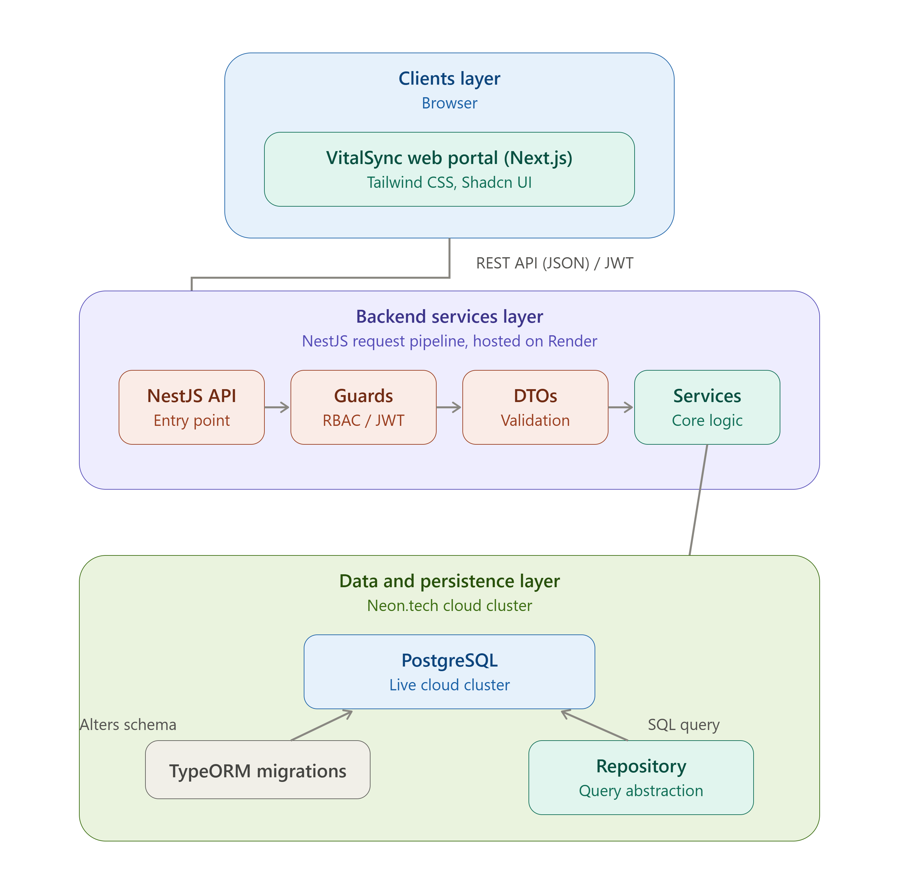

# VitalSync - Enterprise Electronic Health Record (EHR) Dashboard

## 🩺 High-Level Description

VitalSync is a commercial-grade Electronic Health Record (EHR) and clinical management platform engineered to streamline hospital workflows. The system ensures robust data integrity, secure medical archiving, and clean task delegation between healthcare professionals and patients.

## 🛠️ Designated Track & Tech Stack

- **Track:** Fullstack Engineering (Individual Contributor)
- **Frontend:** Next.js, Tailwind CSS, Shadcn UI
- **Backend:** NestJS (TypeScript Framework)
- **Database / Access Layer:** PostgreSQL (Hosted on Neon.tech) via TypeORM
- **Hosting:** Code deployed on Render (Web Service), Database deployed on Neon.tech

## 🎯 Prioritized Core Features (Minimum Viable Product)

1. **Role-Based Access Control (RBAC):** Tiered authentication mapping secure viewing screens dynamically based on user identity (Doctor vs. Patient).
2. **Real-Time Doctor Availability & Scheduling:** Real-time checking of physician time slots to systematically book or cancel medical consultations without conflicts.
3. **Immutable Medical History Timelines:** A centralized ledger tracking patient records, diagnostic notes, and past encounter summaries chronologically.
4. **Prescription State Management:** Isolated lookup system for writing, managing, and tracking current and historical patient pharmaceutical allocations.
5. **On-Demand Medical Archiving (Bonus Feature):** Browser-side extraction engine converting localized relational DTO ledgers into portable, downloadable CSV spreadsheets for physical clinical storage.

---

# ⚙️ Architecture & Technologies Used

## Frontend Architecture (Client-Side)

| Technology | Where / Why Used |
| --- | --- |
| **Next.js** | Serves as the foundational enterprise framework, governing routing, layouts, and page structures. |
| **React** | Powers the core visual UI components, patient timelines, and clinical scheduling tables. |
| **Axios** | Handles asynchronous HTTP API communications between the client layer and the NestJS server. |
| **TypeScript** | Enforces strict compile-time type safety across component properties, hooks, and interface contracts. |
| **Blob API** | Dynamically packages raw string data down in the client browser for localized report compiling. |
| **URL.createObjectURL()** | Generates real-time, sandboxed file strings to execute seamless downloads of patient histories. |

## Backend Engine (Server-Side)

| Technology | Where / Why Used |
| --- | --- |
| **NestJS** | Serves as the primary enterprise framework, maintaining strict Controller-Service modular architecture. |
| **REST APIs** | Establishes standard stateless JSON data-transfer layers mapping clean HTTP verbs (GET, POST, PUT, DELETE). |
| **NestJS Guards** | Governs stateless Role-Based Access Control (RBAC), replacing the Java `@PreAuthorize` paradigm. |
| **JWT (JSON Web Tokens)** | Manages secure, stateless web session authentications across independent hosting environments. |
| **Bcrypt** | One-way hashes client credentials natively before writing sensitive login records to disk. |
| **DTO Pattern** | Sanitizes and validates incoming application inputs before data hits deep business service layers. |

## Data & Persistence Layer

| Technology | Where / Why Used |
| --- | --- |
| **PostgreSQL** | Acts as the primary database engine, maintaining strict relational structures and ACID boundaries. |
| **TypeORM** | Functions as the object-relational mapping (ORM) engine, replacing Hibernate/JPA paradigms. |
| **Repository Pattern** | Segregates raw query executions away from business validation loops to maintain low technical debt. |
| **TypeORM Migrations** | Executes systematic database evolution tracking, functioning **identically to Flyway migration scripts** by applying time-stamped incremental updates. |

---

## 📐 System Architecture Diagram

*Note: Built with PostgreSQL strict foreign key constraints using TypeORM to ensure clinical data compliance.*

.png)

## 🎨 UI/UX Wireframes

[**🔗 Click Here to View the Public Figma Wireframes**](https://www.figma.com/board/dq2FnmCBGmtSzdFMW803Cl/VitalSync?node-id=0-1&t=f9K2Wi18FPNDFkiD-1)
